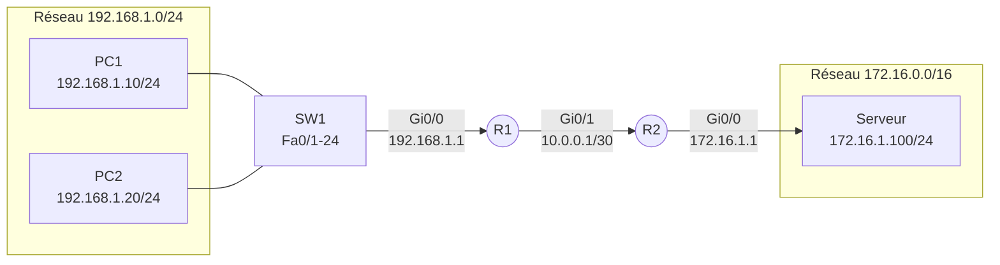
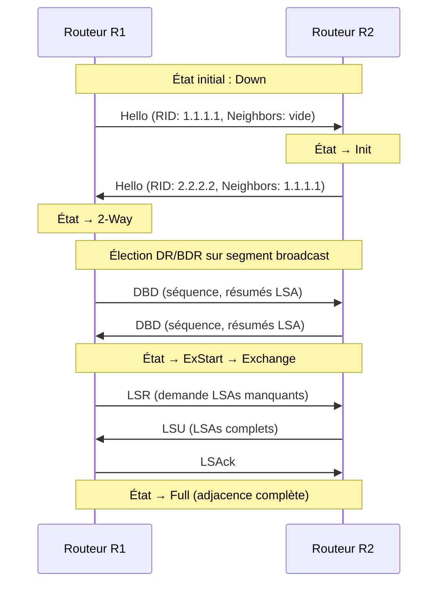
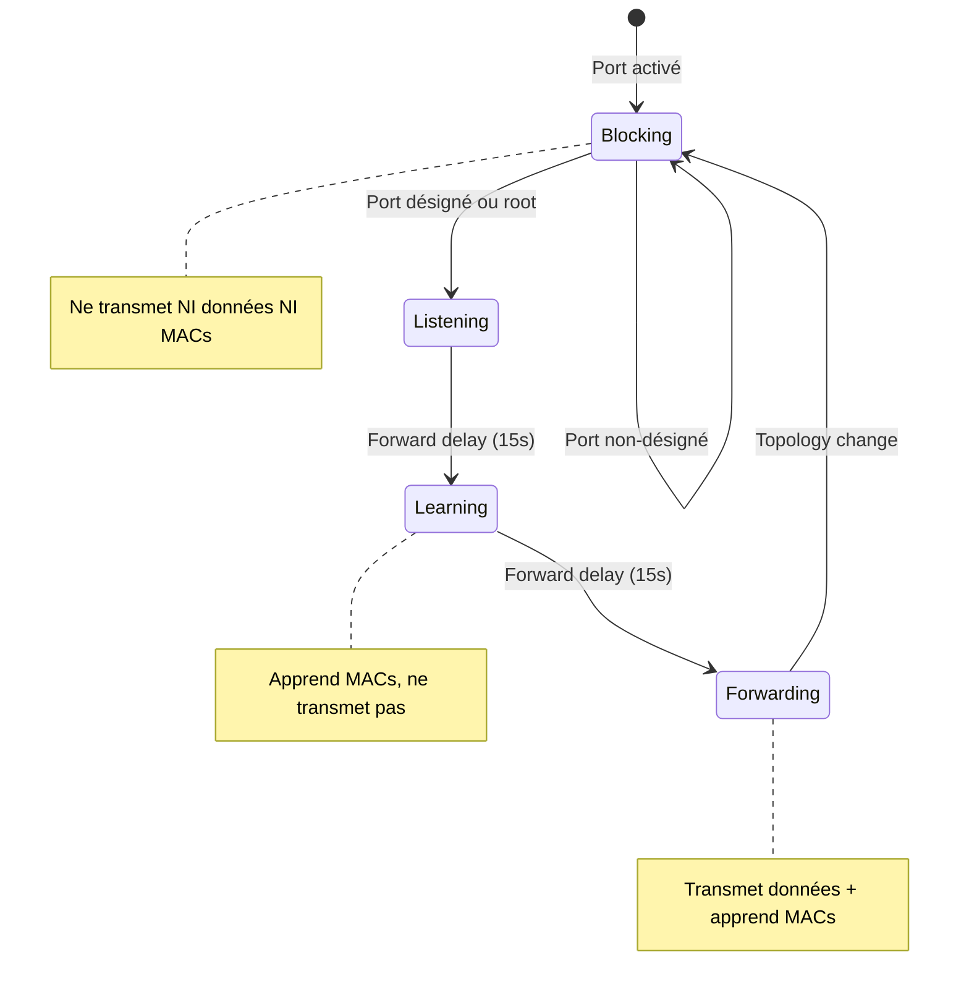
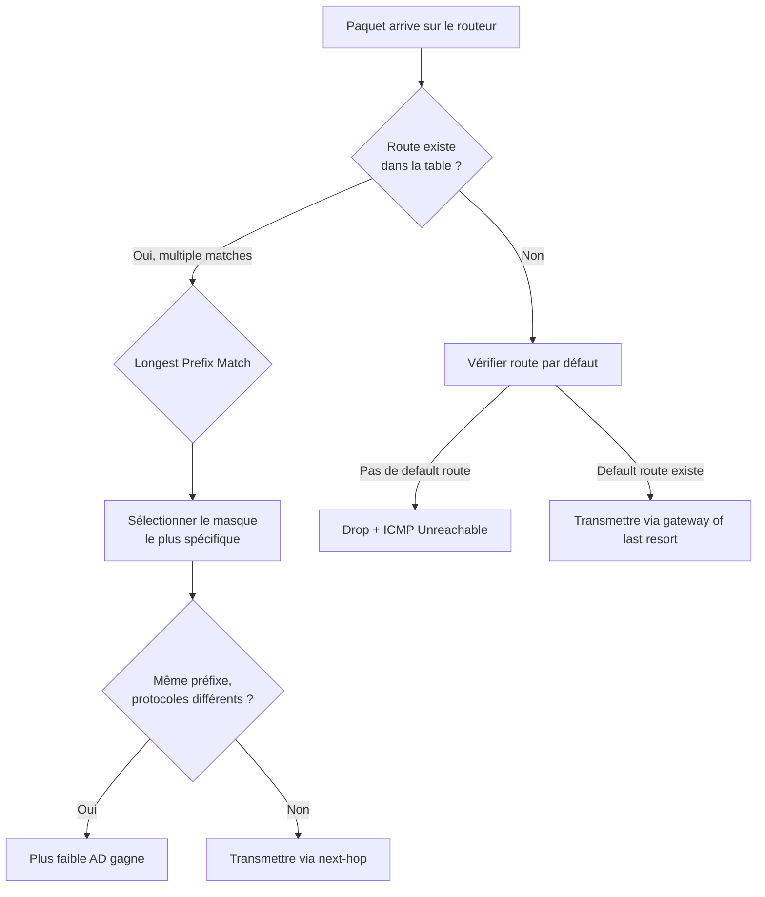
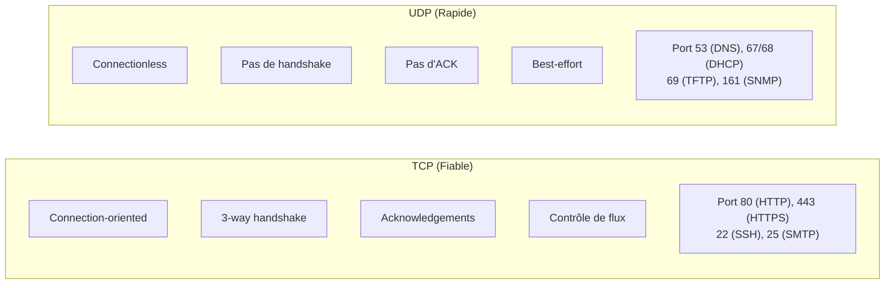

# Conventions Visuelles — Diagrammes & Schémas Réseau

## Inventaire minimum de diagrammes par module

| Module | Diagrammes Mermaid minimum | Types principaux |
|--------|---------------------------|------------------|
| M1 — Network Fundamentals | 10 | topologie, comparatif, sequenceDiagram |
| M2 — Network Access | 8 | topologie VLAN, stateDiagram STP, sequence LACP |
| M3 — IP Connectivity | 10 | topologie routage, stateDiagram OSPF, flowchart |
| M4 — IP Services | 8 | sequenceDiagram DHCP/DNS, topologie NAT, flowchart QoS |
| M5 — Security Fundamentals | 9 | flowchart ACL, sequenceDiagram attaques, comparatif |
| M6 — Automation | 7 | graph SDN, flowchart REST, comparatif outils |
| **Total minimum** | **52** | |

## Types de diagrammes et usage

### 1. Topologies réseau — `graph LR` ou `graph TD`

**Quand** : Illustrer une architecture physique ou logique avec des équipements interconnectés.

**Conventions** :
- Routeurs : rectangles arrondis avec hostname + IPs par interface
- Switches : rectangles avec hostname + VLANs
- PCs/Serveurs : rectangles simples avec hostname + IP/masque
- Liens : étiquetés avec type d'interface + adresse IP du segment
- Sous-réseaux : regroupés dans des subgraph étiquetés

### 2. Échanges de protocoles — `sequenceDiagram`

**Quand** : Illustrer un échange temporel de messages entre entités.

**Conventions** :
- Participants nommés avec rôle (Client, Serveur, Routeur R1)
- Messages avec nom du paquet/trame + champs clés
- Notes pour les timers, états, décisions
- Boucles (loop) pour les processus répétés

### 3. États et transitions — `stateDiagram-v2`

**Quand** : Illustrer les états d'un protocole ou d'un mécanisme avec conditions de transition.

### 4. Arbres de décision / Processus — `flowchart TD`

**Quand** : Illustrer un algorithme, un processus de décision, ou un troubleshooting.

### 5. Comparaisons — `flowchart LR` avec branches

**Quand** : Comparer deux concepts, protocoles, ou technologies côte à côte.

## Règles globales

### Taille
- Maximum 25 lignes de code Mermaid par diagramme
- Si plus complexe → découper en 2 diagrammes avec cross-reference
- Les labels doivent tenir sur une ligne (max ~40 caractères)

### Lisibilité
- Toujours un titre avant le bloc mermaid (### ou ####)
- Toujours une légende/explication après le diagramme (1-3 lignes)
- Pas de diagramme sans contexte textuel autour

### Labels
- En français sauf pour les termes techniques Cisco (show, interface, etc.)
- Adresses IP complètes avec masque CIDR (/24, /30)
- Noms d'équipements cohérents dans tout le module (R1, SW1, PC1)

### Couleurs et styles Mermaid
- Utiliser les styles par défaut de Mermaid (thème neutral dans Quarto)
- Pas de classDef custom sauf pour distinguer des groupes dans une topologie
- Les subgraph pour regrouper par sous-réseau, VLAN, ou zone de sécurité

### Nomenclature pour fichiers externalisés (.mmd)
Format : `m[module]-[topic]-[description].mmd`
Exemples :
- `m1-tcp-handshake.mmd`
- `m3-ospf-adjacency-states.mmd`
- `m5-acl-processing-flowchart.mmd`

Seuil d'externalisation : >20 lignes de code Mermaid → fichier .mmd séparé
